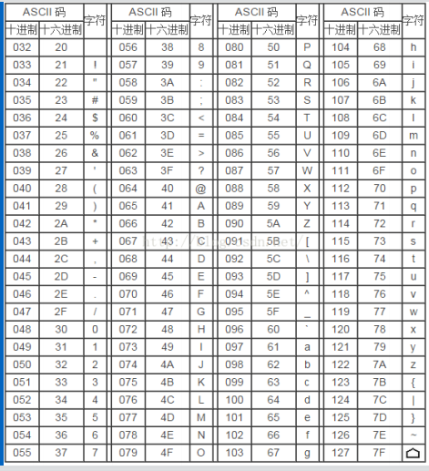

# 输出与输入

## 一、计算机的输入输出
- 输入输出是以计算机主机为主体而言
- 从外部设备向计算机输入数据称为 **输入**
  - 如键盘、磁盘、光盘、扫描仪等
- 从计算机向外部设备输出数据称为 **输出**
  - 如显示屏、打印机、磁盘等

## 二、C语言中的输入输出
- 实现C程序与用户的交互
- C语言本身不提供输入输出语句
- 输入和输出操作是由函数来实现
  - printf和scanf不是C语言的关键字，只是函数的名字
### 2.1 标准输入输出函数
在调用标准输入输出库函数时，文件开头应有以下预编译命令∶
```
#include <stdio h>或
#include "stdio.h"
```
- <>标准路径
- ""当前（可执行文件）所在路径

### 2.2 常用的标准输入输出函数
```
printf（） /格式输出函数/
scanf（）  /格式输入函数/
putchar（）/单个字符输出函数/
getchar（）/单个字符输入函数/
puts（）   /字符串输出函数/
gets（）   /字符串输入函数/
```

#### 2.2.1 prinrf()格式输出函数
- 常用的格式说明符（占位符）∶
```
%d∶十进制整数（带符号）
%f：浮点数（单、双精度数）
%c∶单个字符
%s∶字符串：
%e∶科学计数法
%o∶八进制
%x∶十六进制
```

#### 2.2.2 scanf()格式输入函数
- 常用的格式说明符∶
```
%d：十进制整数（带符号）
%f：浮点数（单精度数）
%lf∶浮点数（双精度数）（与printf不同!）
%c∶单个字符
%s∶字符串
```

### 2.3  ASCII表



## 三、C语言文件的操作

### 3.1 文件的编码
- 文本文件
  - 字符组成
  - ASCll码
  - .txt 
- 二进制码文件
  - 二进制数据
  - 特定格式
  - .jpg .mkv .doc

### 3.2 流操作
C语言的文件又称为**流**，对文件操作就是对这种"流"进行操作
- 字符文件被看成为字符"流"
- 二进制文件被看成为二进制数码"流"
- 从某个输入流的输入信息中使用读函数提取信息，存放在变量中
- 使用写函数将某种信息输入到输出信息流中，存放到某个设备中

### 3.3 操作与一般流程
- 定义文件指针
  - 示例∶FILE*fp;
- 打开
  - fopen（"<文件名><打开方式>";
  - 指明打开文件路径和文件名
  - 指明打开文件方式 
- 读、写信息
  -  fscanf() 
  - fprintf() 
- 关闭
  - fclose(fp)

#### 3.3.1 文件指针
- 指向文件的指针，即指针指向的对象是某个文件。
- FILE *fp;
  - 文件类型说明符
  - 存放在stdioh文件中
  - 被定义成具有5个成员的结构类型
  - 用来存放有关文件的信息

#### 3.3.2 fopen()打开文件函数

- 打开方式∶
```
r   读方式
w   写方式
a   追加写方式
r+  可读可写方式 
w+  可写可读方式
rb  二进制文件读方式
wb  二进制文件写方式
ab  二进制文件追加写方式
rb+ 二进制可读可写方式
wb+ 二进制可写可读方式
```
- fopen()函数返回一个地址值(故敲fp=fopen)
- 将该函数返回的地址值赋给一个文件指针，表示让这个文件指针指向被打开的文件（缓冲区）
- 若函数值非零，文件被正常打开，该函数值便是存放被打开文件的内存缓冲区的首地址;
- 若函数值为零（NULL），文件打开失败
- exit（）须使用头文件 stdlib.h
```
FILE *fp;
fp=fopen("c:\\abc.dat","wb");
if(fp=NULL){
   printf("file can't open!\n");     
   exit(1);
}
```

#### 3.3.3 fclose()关闭文件函数
- 格式：fclose（<文件指针>） 如：fclose（fp）
- 一次只能关闭一个被打开的文件
- 好处：
  - 释放内存，提高运行效率
  - 保证文件内容安全

#### 3.3.4 文件的读写操作
- 针对一个字符的读写函数（暂未教）
- 针对一个字符串的读写函数（暂未教）
- 针对一个数据块的读写函数（暂未教）
- 带格式的读写函数
  - fprintf（文件指针，格式控制字符串，输出表列）
  - fscanf（文件指针，格式控制字符串，地址表列）
