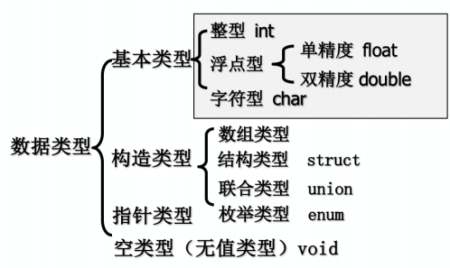
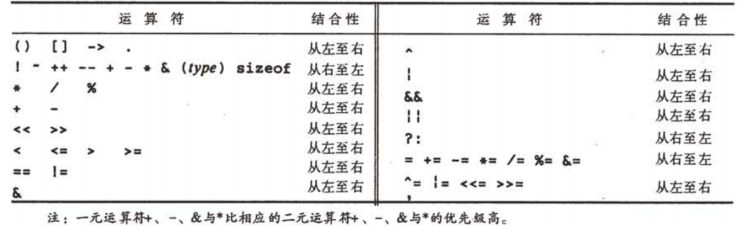

# 顺序结构程序设计

**计算机的输入输出**

- 三种基本结构：顺序结构、选择结构、循环结构 
- 顺序结构：程序的执行顺序从上到下，逐行执行
## 一、变量与常量
- 变量：在程序运行过程中，其值可以被改变的量
- 常量：在程序运行过程中，其值不能被改变的量

### 1.1 常量
- 字面常量：直接写在程序中
- 符号常量：使用define预编译指令定义
  - 写在源程序文件的前端，后面没有
  - 常量的名称一般用大写字符
  - #define MAX 100

### 1.2 变量
- 先定义，后使用
- 变量须要指定数据类型
- 变量定义的一般格式
  - 数据类型 变量名1，变量2,…，变量名 n;
  - 变量名：合法标识符，通常使用小写字母
  - 数据类型：决定存放何种数据、如何存
- 同一函数体或分程序中，不能定义两个同名的变量

### 1.2.1 变量的本质
- 变量代表内存中的一个存储单元
  - 变量名称实际上是存储单元地址的别名
  - 变量的值是存储单元中存放的数据
- 从变量中取值，实际上是通过变量名找到相应的内存地址，从该存储单元中读取数据。

### 1.2.2 变量命名：标识符
- 标识符只能由字母、数字和下划线组成
  - 第一个字符必须为字母或下划线
- 区分大写字母和小写字母
- 命名时应"见名知意"，即选有含意的英文单词（或其缩写）作标识符，增强可读性

# 二、数据类型


## 2.1 数据类型的存储长度
```
整型(int)：4字节
字符型(char)：1字节
单精度(float)：4字节
双精度(double)：8字节
```
**sizeof()运算符**

## 2.2 整型(int)
整型**常量**有三种表示方法：
- 十进制
- 八进制：加前缀0
- 十六进制：加前缀Ox

## 2.2.1 C中的八进制和十六进制整数
- 八进制：以0起始
- 十六进制：以0x或0X起始
  - A~F或a~f代表10~15
  - 存储地址
  - 按位控制
- 八进制和十六进制都是二进制的简记形式

## 2.3 浮点型(float, double)
- 即实型
  - 小数形式
  - 指数形式
- float
  - 32位(bits)
  - 表示范围：10e37〜10e38
  - 有效数字：7位
- double
- 64位(bits)
- 表示范围：10e307〜IOe308
- 有效数字：15位
### 2.3.1 浮点数的指数形式
**科学计数法**
- 举例
  - 123.456 -> 1.23456e3
  - 12e4,1.2e12,0.9e-3,3e4
- 输出格式符：%e
- 字母e（或E）之前必须有数字，且e后面须为整数

## 2.4 字符型（char）
单个字符输出：%c
单个字符的三种表示方式：
- 直接表示方式：如‘A’, ‘9’
- 转义字符表示方式：
  - '\n':回车并换行
  - '\'：单撇号本身
  - '\\',：斜杠本身
  - '\t'：横向跳格
  - '\r'：回车
- ASCII码表示方式
  - 字符的+和-：移位

### 2.4.1 字符串
- 一对双引号括起来的字符序列
- **每个字符串都有一个结束符'\0'**
- 在C中，字符串不是一种基本数据类型，也没有字符串变量
- 输出：%s

## 2.5 运算符
```
算术运算符：+ - * / % ++ --
关系必畀符：< <===> >=!=
逻辑运算符：！ && ||
位运算符：<< >> ~ | A &
赋值运算符：=+= -= *= /= %=
条件运算符：？：
逗号运算符：，
指针运算符：* &
求字节数：sizeof
强制类型转换：（类型）
分量运算符：.->
下标运算符：[]
其它：（）-
```

### 2.5.1 运算符的优先级与结合性

- 优先级列表一般规律
  - 单目运算：优先级最高
  - 算术运算优先级高于赋值运算
  - 算术运算中，* /优先级高于+ - 回括号改变优先级
- 括号改变优先级
- 表达示求值

### 2.5.2 算术运算符
- 算术运算:从左向右结合
- 运算符：
```
+ ：加法运算符，或正值运算符
- ：减法运算符，或负值运算符
* : 乘法运算符
/ ：除法运算符。整数相除，结果为整数
% :模运算符，或称求余运算符。要求两侧均应为整型数据
```
**自增++、自减--**
- 作用：使变量值加1或减1
- 种类：
  - 前置++i, --i （先执行i+1或i-1，再使用i值）
  - 后置i++,i--（先使用i值,再执行i+1或i-1）
- 只能用于整型变量、字符变量
- 不能用于常量或表达式

### 2.5.3 赋值运算
- 从右向左结合
- 赋值运算符:=
- 复合赋值运算符:+=, -=, *=,/=, %=

### 2.5.4 数据长度运算符sizeof
- 求数据类型/变量在内存中所占的字节数
- 用法：sizeof(＜类型说明符＞/〈变量名〉)
printf("%d",sizeof(a));

### 2.6 数据类型转换
- 不同数据类型的运算量，在运算过程中可以进行转换
- 自动类型转换：
  - 低精度类型转换为高精度类型
- 强制转换
  - 使用数据类型转换运算符()

#### 2.6.1 自动类型转换
- 一般地，低精度类型转换为高精度类型
  - char ->int
  - int ->浮点数
  - float -> double
- 例：
  - 5%7+3*1.0 -> 8.0
```
int i; float f;
i=3.14;
f=i;
prinA("%d,%f", i,f);
->3,3.0
```

#### 2.6.2 强制类型转换
- 可以利用强制类型转换运算符()将一个表达式转换成所需类型
- 一般形式：(类型名)(表达式)
- 例：
  - (double) a ：将 a 转换成double类型
  - (int)(x+y)：将x+y的值转换成整型
  - (float)(5%3)：将5%3的值转换成float型
- 在转换时产生一个临时变量，存放转换好的数据
- 原来数据的类型未发生改变

# 三、表达式
- 变量、常量和函数以及运算符按一定规则组合起来的算式
- 表达示求值
  - 其结果有一个确定的值
  - 其结果有一个确定的类型
- 合法与不合法